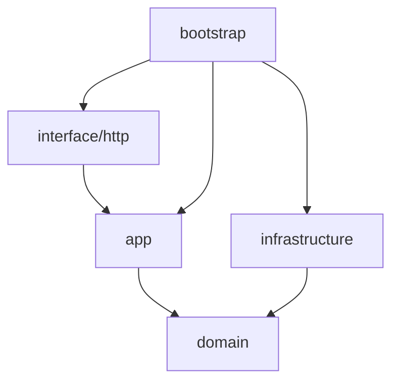

# 04 项目结构


以 `goeasy-cli new` 生成的 DDD Lite 项目为准；默认 **`codegen.layout: domain`**（按限界上下文组织）。


## 顶层目录


```text

<project>/

├── cmd/service/           唯一入口：装配 goeasy，不写业务逻辑

├── internal/              业务与适配（不对外暴露）

├── configs/               配置文件

├── api/                   契约与生成物

├── deploy/                部署（docker / k8s）

├── docs/                  项目文档

├── migrations/            数据库迁移占位

└── test/                  集成测试占位

```

**关于 `pkg/`**：模板**不预置** `pkg` 目录。业务与适配代码放在 `internal/`；可复用运行时能力在 `goeasy` 模块；项目内技术共享放 `internal/infrastructure/shared/`。仅当需要向**其他 Go 模块**暴露无业务语义的公共库时，再手动创建 `pkg/`（勿将 domain/app 放入 `pkg`，以免破坏 `internal` 边界）。


## internal 分层（domain 布局）


```text

internal/

├── domain/<domain>/<resource>/     领域包名 = resource（如 system/roles → package roles）

├── app/<domain>/<resource>/        应用层（command/ query/ port/）

├── interface/

│   ├── http/

│   │   ├── admin/<domain>/<resource>/   管理后台 HTTP（AdminAuth）

│   │   ├── h5/<domain>/<resource>/      H5 HTTP（MemberAuth）

│   │   ├── health/                      健康检查（无 /api/v1 前缀）

│   │   └── middleware/

│   └── grpc/<domain>/<resource>/        gRPC 服务实现

├── infrastructure/

│   ├── shared/                          dbx、cache、mq、client、driver

│   ├── <domain>/

│   │   └── persistence/<resource>/      仓储实现（repository_pg / memory）

│   └── rpc/                             跨服务 gRPC Gateway（ACL）

└── bootstrap/             wire.go、modules.go、register_<domain>.go、grpc.go
    snippets/              可选：`*_grpc.md`（proto）、mqdemo 说明；不生成 `*_wire.md`

```


**模块 ID**（表名/缓存 key/proto 文件名）与 **领域路径** 分离：例如表 `sys_roles` → `domain/system/roles`，模块 ID 仍为 `sys_roles`。


## 依赖方向（必须遵守）





- **interface** 不得 `import` **infrastructure**

- **domain** 不得依赖 **app**、**interface**、**infrastructure**

- 所有 `new` 与路由注册集中在 **bootstrap/wire.go**


## HTTP 路由


```text

/api/v1/{surface}/{domain}/{resource}[/{id}]

```


| 段 | 含义 | 示例 |

|----|------|------|

| `surface` | 客户端触达面 | `admin`、`h5`、`app` |

| `domain` | 限界上下文 | `system`、`order` |

| `resource` | REST 资源 / Go 包名 | `roles`、`configs` |


示例：`GET /api/v1/admin/system/roles/1`（`sys_roles` + `codegen.domains.system`）。


配置见 `configs/config.yaml` → `codegen.domains`；CLI 可用 `--domain` / `--resource` 覆盖。


## 示例：health 模块


health 为脚手架内置模块，仍使用单段路径 `domain/health`（非 BC 拆分示例）。


## cmd/service 职责


只做三件事：加载配置、创建 `app.New`、注册 `bootstrap.RegisterRoutes` 并 `Run()`。


## api 目录


| 目录 | 用途 |

|------|------|

| `api/openapi/<client>/<domain>/` | OpenAPI 契约；`add db openapi` 输出、`gen http` 默认读取 |

| `api/examples/<client>/<domain>/<module_id>/` | `add db crud` 生成的 `crud.http`（REST Client 联调） |

| `api/proto/` | gRPC 契约源文件 `*.proto` |

| `api/proto/gen/<module>/` | `gen proto` 生成的 `*.pb.go`（需提交） |


## 下一步


- 运行时能力：[05 goeasy 运行时](05-goeasy-runtime.md)

- 分层实践：[07 DDD Lite 实践](07-ddd-lite-practices.md)


