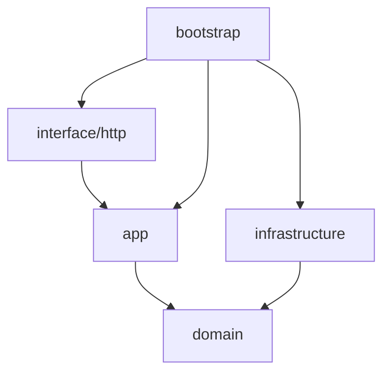

# 04 项目结构

以 `goeasy new` 生成的 DDD Lite 项目为准。

## 顶层目录

```text
<project>/
├── cmd/service/           唯一入口：装配 goeasy，不写业务逻辑
├── internal/              业务与适配（不对外暴露）
├── configs/               配置文件
├── api/                   契约（proto / openapi）
├── deploy/                部署（docker / k8s）
├── docs/                  项目文档
├── migrations/            数据库迁移占位
└── test/                  集成测试占位
```

## internal 分层

```text
internal/
├── domain/<module>/       领域：实体行为、聚合、值对象、仓储接口、领域服务、事件
├── app/<module>/          应用：Application 门面 + command/ + query/
├── interface/
│   ├── http/<module>/     HTTP：handler / request / response / router
│   └── grpc/              gRPC 占位
├── infrastructure/
│   ├── persistence/<m>/   仓储实现
│   ├── client/ cache/ mq/ 外部依赖占位
└── bootstrap/             应用启动引导程序: 依赖注入 + RegisterRoutes
```

## 依赖方向（必须遵守）



- **interface** 不得 `import` **infrastructure**
- **domain** 不得依赖 **app**、**interface**、**infrastructure**
- 所有 `new` 与路由注册集中在 **bootstrap/wire.go**

## 示例：health 模块数据流

1. `GET /health` → `interface/http/health.Handler`
2. Handler 调用 `app/health.Application` 或 QueryHandler
3. Application 编排 `domain/health` 实体与 DomainService
4. 持久化通过 `domain/health.Repository` 接口，由 `infrastructure/persistence/health` 实现

## cmd/service 职责

只做三件事：加载配置、创建 `app.New`、注册 `bootstrap.RegisterRoutes` 并 `Run()`。

禁止在 `main` 中写业务分支或直接操作数据库。

## 契约与部署

| 目录 | 用途 |
|------|------|
| `api/proto/` | gRPC / 事件契约源文件 |
| `api/openapi/` | REST 文档导出占位 |
| `deploy/docker/` | 容器构建 |
| `deploy/k8s/` | K8s 清单占位 |

## 下一步

- 运行时能力：[05 goeasy 运行时](05-goeasy-runtime.md)
- 分层实践：[07 DDD Lite 实践](07-ddd-lite-practices.md)
