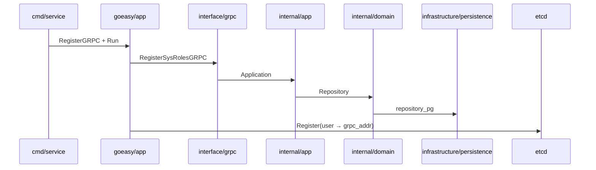
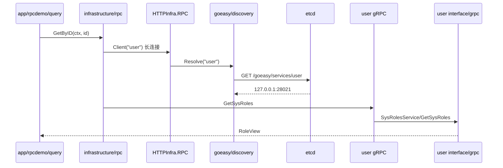

# 12 跨服务 gRPC 调用（ETCD / direct）

本文说明如何在 **DDD Lite 业务项目** 中，让 order 等调用方通过 **逻辑服务名**（如 `user`）访问对端 gRPC，类似 go-zero 的 `Etcd Host + Key`，并介绍 **无需复制 proto** 的 CLI 联调方式。

运行时配置见 [gRPC 与服务发现](../runtime/grpc-discovery.md)；项目集成见 [11 gRPC 项目集成](11-grpc-internal.md)。

## 概念对照

| go-zero | goeasy |
|---------|--------|
| `Etcd.Hosts` | `discovery.etcd.endpoints` |
| `Etcd.Key` + 服务名 | `{prefix}/{app_name}`，默认 `/goeasy/services/user` |
| zrpc 客户端 | `app.NewGRPCClientForService(ctx, "user")` |
| grpcurl 联调 | `goeasy-cli grpc call/list/resolve` |

**逻辑服务名 = `app_name`**（如 `user`）。`sys_roles.SysRolesService` 是同一端口上的 **gRPC Service 名**，不是 ETCD key。

## 三层调用方式

| 层级 | 场景 | 是否需要本地 .proto |
|------|------|---------------------|
| **L1 联调** | `goeasy-cli grpc resolve/call/list` | 否（Server Reflection） |
| **L2 契约** | `gen proto --from-url` / 共享 contracts 模块 | 拉取或依赖一份契约 |
| **L3 业务代码** | `infrastructure/client` + `pb.NewXxxClient` | 是（`*.pb.go`） |

## 配置示例

### 提供方 user（注册到 ETCD）

```yaml
app_name: user
grpc:
  enabled: true
  addr: "0.0.0.0:28021"
discovery:
  mode: etcd
  etcd:
    enabled: true
    endpoints: ["127.0.0.1:2379"]
    advertise_addr: "127.0.0.1:28021"
    prefix: /goeasy/services
  services:
    user: "127.0.0.1:28021"
```

启动日志应出现：`discovery registered user -> 127.0.0.1:28021`。

### 调用方 order（客户端可不启 gRPC 服务端）

```yaml
app_name: order
grpc:
  enabled: false          # 仅作客户端时可 false
discovery:
  mode: etcd
  etcd:
    enabled: true
    endpoints: ["127.0.0.1:2379"]
    prefix: /goeasy/services
  services:
    user: "127.0.0.1:28021"   # etcd 不可用时的 fallback；填 gRPC 端口，非 2379
```

## CLI 快速调用（L1，无需 proto）

需本机安装 [grpcurl](https://github.com/fullstorydev/grpcurl/releases)。对端需开启 Reflection（goeasy 默认已开）。

```bat
cd order

REM 解析服务名 → host:port（etcd 或 direct）
goeasy-cli grpc resolve --service user

REM 列出对端 Service
goeasy-cli grpc list --service user

REM 调用 RPC（JSON body；--data 与 --method 同一行）
goeasy-cli grpc call --service user --method sys_roles.SysRolesService/GetSysRoles --data "{\"id\":\"1\"}"

REM PowerShell 推荐单引号 JSON
REM goeasy-cli grpc call --service user --method sys_roles.SysRolesService/GetSysRoles --data '{"id":"1"}'

REM 跳过发现，直连地址
goeasy-cli grpc call --target 127.0.0.1:28021 --method sys_roles.SysRolesService/GetSysRoles --data "{\"id\":\"1\"}"
```

## 远程契约拉取（L2）

不必手工复制 proto 文件：

```bat
goeasy-cli gen proto --from-url /home/myprojects/user/api/proto/sys_roles.proto
goeasy-cli gen proto --from-url https://example.com/contracts/sys_roles.proto
```

下载到 `api/proto/imported/` 后，CLI 会将 `go_package` **重写为当前项目 module**（如 `github.com/org/order/api/proto/gen/imported/...`），再执行 protoc 生成 `api/proto/gen/imported/*.pb.go`。

更推荐长期方案：独立 **contracts** 模块，user/order 在 `go.mod` 中共同 `require`。

## 业务代码调用（L3）

推荐 **RPC Gateway + 长连接**（详见 [14 RPC Gateway 接入](14-rpc-gateway-integration.md)）：

```go
// app/rpcdemo/query/get.go — 业务一行
role, err := h.roles.GetByID(ctx, id)
```

bootstrap 装配：

```go
rolesGW := demod8rpc.NewSysRolesGateway(cli)  // cli from bootstrap.RPCClient(infra, "user")
```

快速生成：`goeasy-cli add rpcdemo --remote user`

低级 API（联调/测试，勿在业务 Query 中每次 Close 长连接）见 `internal/infrastructure/client/grpc_client.go`。

## DDD Lite 架构图

### user 提供 gRPC 服务



### order 调用 user（ETCD 发现）



### 调用链分层

```text
interface/http  →  app/query  →  app/port (Gateway)
                                    ↑
                         infrastructure/rpc  →  HTTPInfra.RPC  →  discovery/etcd  →  远端 gRPC
```

## 排错

| 现象 | 处理 |
|------|------|
| `lease list` 为 0 | user 未注册；查 `discovery registered` 日志 |
| resolve 到 `127.0.0.1:2379` | `services.user` 误填 etcd 端口，应改为 gRPC 端口 |
| `grpcurl not found` | 安装 grpcurl 或用 `goeasy-cli grpc` 提示的链接 |
| `No host:port specified` | 旧版 CLI grpcurl 参数顺序错误；升级 goeasy-cli |
| list 只有 Reflection | user 未 `gen proto` / 未 `RegisterSysRolesGRPC` |
| `invalid --data JSON` | `--data` 勿换行；CMD 用 `--data "{\"id\":\"1\"}"` 或 PowerShell 用 `'{"id":"1"}'` |
| `go_package` 与 order 不一致 | 使用 `gen proto --from-url`（会自动重写）；或手改 `go_package` |
| 业务代码编译缺 pb | L2 `gen proto --from-url` 或共享 contracts |

## 相关文档

- [11 gRPC 项目集成](11-grpc-internal.md)
- [06 CLI 命令](06-goeasy-cli-commands.md)
- [07 DDD Lite 实践](07-ddd-lite-practices.md)
- [14 RPC Gateway 接入](14-rpc-gateway-integration.md)
